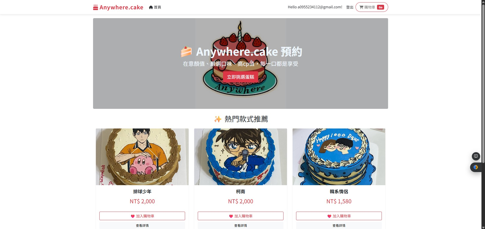
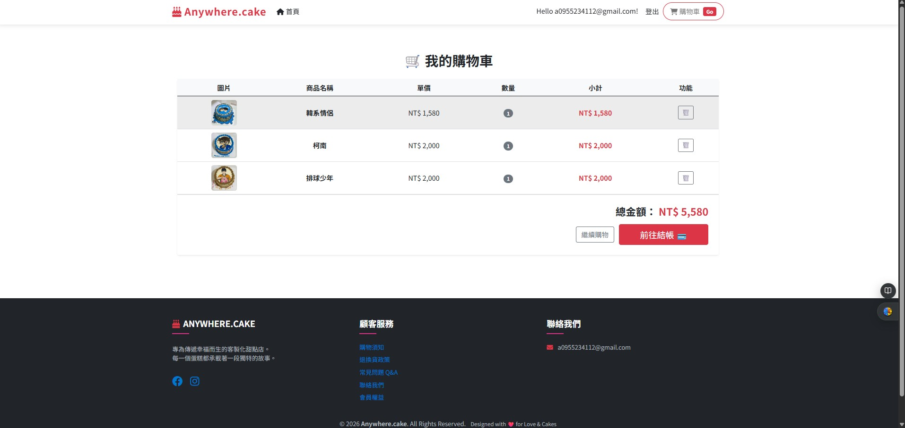
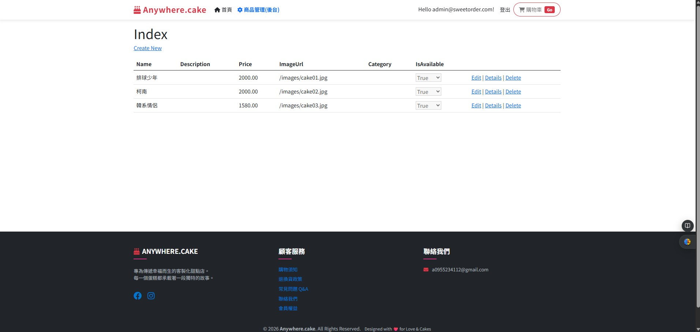
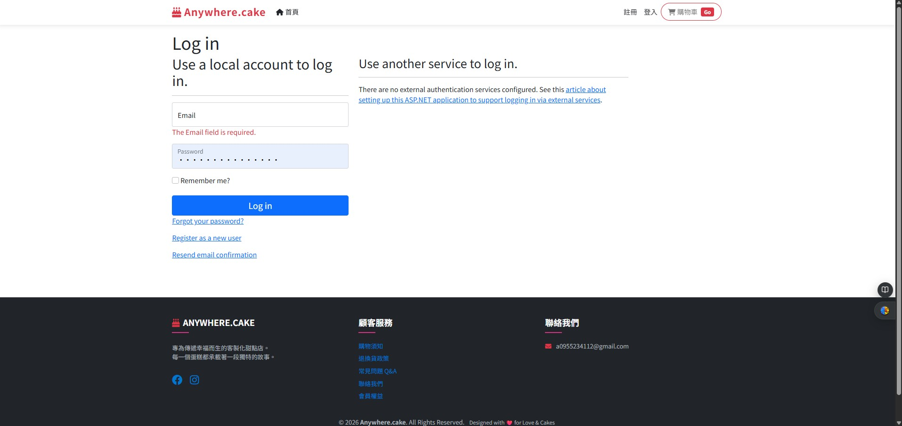

SweetOrder (Anywhere.cake) - 客製化蛋糕訂購系統

專為手作甜點店打造的數位轉型解決方案
解決傳統私訊接單的混亂，提供從「客製化下單」到「後台管理」的一站式服務。

系統展示 (Screenshots)

🔹 前台體驗

首頁與商品列表

購物車與結帳流程

🔹 後台管理

後台管理系統

權限控管與登入

技術架構 (Tech Stack)

核心框架: .NET 8.0 / ASP.NET Core MVC

	採用 MVC 架構

程式語言: C# 12

	使用最新語法特性

資料庫: SQL Server / Entity Framework Core

	Code-First 開發模式、LINQ 查詢

前端互動: JavaScript / AJAX (Fetch API)

	非同步加入購物車、SweetAlert2 彈窗

前端介面: Bootstrap 5

	RWD 響應式設計、質感主題

版控: Git / GitHub

	版本控制與協作管理

 核心功能

1. 前台：流暢的購物體驗 (Client-Side)

	動態展示：透過 Razor 語法動態渲染資料庫商品。

	購物車功能：使用 Session 進行狀態管理，並整合 AJAX 實現不刷新頁面的操作體驗。

2. 後台：權限與資料管理 (Server-Side)

	權限控管 (RBAC)：整合 ASP.NET Core Identity，實作基於角色的存取控制 (Role-Based Authorization)。

	資料驗證：實作 Server-Side Validation，確保資料庫資料正確性（如價格精度、必填欄位）。

	自動部署：設計 DbSeeder，系統啟動時自動檢查並建立初始環境與管理員帳號。

資料庫設計 (Database Schema)

本系統符合 第三正規化 (3NF) 設計原則。

	Users: 會員帳號、密碼雜湊 (PasswordHash)。

	Products: 商品資訊，價格採用 decimal 確保金融精確度。

	Orders: 訂單主檔，設有 Foreign Key 確保參考完整性。

	OrderDetails: 訂單明細，紀錄購買當下價格與客製化需求。

如何執行 (How to Run)

如果您下載了此專案，請依照以下步驟在本地端執行：

複製專案： https://github.com/mike19961102/SweetOrder-AspNetCore-MVC

開啟專案：使用 Visual Studio 2022 開啟 .sln 檔案。

還原資料庫：

開啟 套件管理員主控台 (Package Manager Console)。

輸入指令：Update-Database。

(系統會根據 Migrations 自動建立 SQL Server LocalDB 資料庫)

啟動網站：按下 F5 執行。

登入管理員 (由 Seeder 自動產生)：

Email: admin@sweetorder.com

Password: admin1102

注意：此帳號密碼僅供 Demo 演示使用

 關於開發者

林佑儒 正在轉職挑戰 .NET 後端工程師的路上。