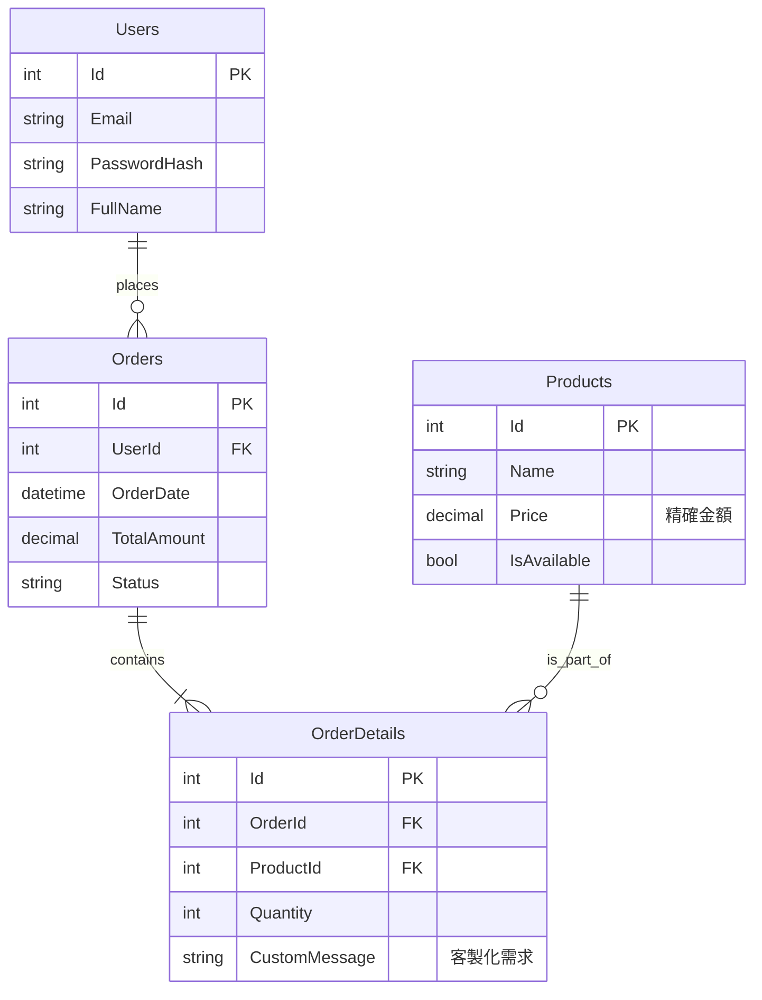

SweetOrder (Anywhere.cake) 系統設計規格書

文件版本: v1.0.0
最後更新: 2026/01/18
開發者: 林佑儒

1. 專案背景與目標 (Project Background)

1.1 痛點分析 (Problem Statement)

現況：目前客製化甜點接單主要依賴社群軟體 (IG/Line) 私訊，導致訂單資訊散落在不同對話視窗，容易漏單或搞錯客製化需求。

問題：缺乏系統化的訂單管理、無法即時計算營收、客戶等待回覆時間過長。

1.2 解決方案 (Solution)

開發一套基於 Web 的 B2C 客製化蛋糕訂購系統，提供消費者自助下單介面，並為管理者提供集中式的後台管理功能。

2. 系統架構設計 (System Architecture)

本系統採用 ASP.NET Core MVC 架構，遵循 關注點分離 (Separation of Concerns) 原則。

2.1 技術堆疊 (Tech Stack)

Presentation Layer (View): Razor Views, Bootstrap 5, JavaScript (AJAX)

Business Logic Layer (Controller): C# Controllers, Identity Management, Session Logic

Data Access Layer (Model): Entity Framework Core (EF Core), SQL Server

2.2 架構圖 (Architecture Diagram)

```mermaid
    graph TD
        User["使用者/瀏覽器"] <-->|HTTP Request/Response| Controller["Controllers (邏輯層)"]
    
        subgraph Web Server
            Controller <-->|Binding| Model["Models (資料結構)"]
            Controller -->|Render| View["Views (畫面層)"]
            Controller <-->|Identity API| Auth["身份驗證系統"]
        end
    
        subgraph Data Storage
            Model <-->|EF Core (ORM)| DB["SQL Server 資料庫"]
        end
```

3. 資料庫設計 (Database Schema)

本系統資料庫設計符合 第三正規化 (3NF)，確保資料無冗餘且具備參照完整性。

3.1 實體關聯圖 (ER Diagram)


3.2 關鍵設計決策

金額型別：所有價格欄位 (Price, TotalAmount) 均使用 decimal(18,2)，以避免浮點數運算誤差，符合金融計算標準。

客製化彈性：將客製化需求（如：巧克力牌文字）儲存於 OrderDetails 而非 Products，確保同一種商品可以有不同的客製化內容。

狀態管理：使用 Orders.Status 欄位追蹤訂單生命週期 (Pending -> Processing -> Completed)。

4. 核心功能邏輯 (Core Workflows)

4.1 購物車與 Session 管理

由於 HTTP 為無狀態協定，本系統使用 Session 配合 JSON Serialization 來實作購物車功能。

邏輯流程：

使用者點擊「加入購物車」。

前端透過 AJAX 發送非同步請求至 CartController。

後端檢查 Session 中是否已有 Cart 物件。

若無：建立新的 List。

若有：反序列化 (Deserialize) 為 List 物件。

更新 List 內容（新增項目或增加數量）。

序列化 (Serialize) 回 JSON 字串並存入 Session。

回傳 HTTP 200 OK，前端顯示 SweetAlert2 成功視窗。

4.2 權限控管 (RBAC)

使用 ASP.NET Core Identity 實作基於角色的存取控制。

Admin 角色：擁有 [Authorize(Roles = "Admin")] 權限，可存取 ProductsController 進行 CRUD 操作。

Member 角色：僅能存取前台與個人訂單。

Guest (訪客)：僅能瀏覽商品與將商品加入購物車，結帳時需註冊/登入（或系統自動建立訪客帳號）。

5. 安全性實作 (Security Measures)

CSRF 防護：所有 POST 請求 (如 Create, Edit) 均加上 [ValidateAntiForgeryToken] 標籤。

輸入驗證 (Validation)：

Client-side: 使用 jQuery Validation 進行即時回饋。

Server-side: 使用 Data Annotations ([Required], [StringLength]) 進行二次檢查，防止惡意請求繞過前端。

資料隱碼防護 (SQL Injection)：全面使用 Entity Framework Core 與 LINQ，透過參數化查詢機制自動防禦 SQL Injection 攻擊。

6.未來展望 (Future Roadmap)

金流串接：計畫整合第三方支付服務（如綠界 ECPay 或 LinePay API），實現線上即時付款功能，提升結帳便利性。

訂單通知系統：整合 SendGrid 或 SMTP 服務，於訂單成立及狀態更新時（例如：開始製作、可取貨），自動發送 Email 通知客戶。

數據分析儀表板：於後台導入 Chart.js，視覺化呈現「每日營收」、「熱銷商品排行」與「會員成長趨勢」，輔助商業決策。